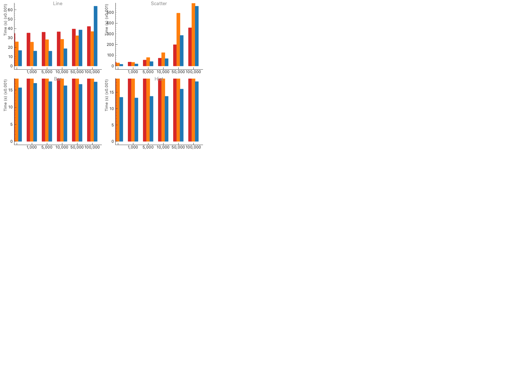
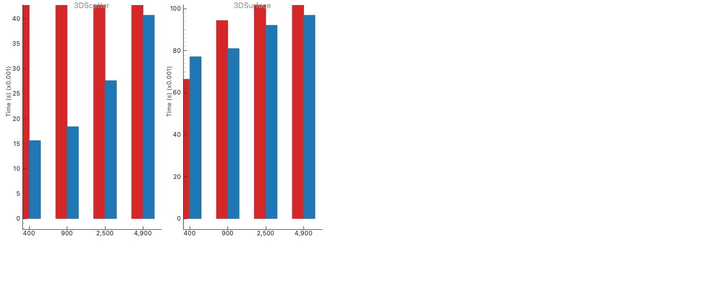

# ShenBi 性能基准测试报告

*2026-05-05 15:19:35*

[English Report](benchmark_report.md)

## 概述
等条件对比：4种2D图表（6个规模：500→10万）+ 2种3D图表（4个网格）。全部DPI=25。热身+3次测量取中位数。

## 测试环境

| 项目 | 值 |
|------|-----|
| 平台 | Darwin arm64 |
| Python | 3.12.12 |
| pyqtgraph | 0.14.0 |
| matplotlib | 3.10.8 |
| ShenBi | 0.1.1 |

## 折线图

| 数据量 | matplotlib | pyqtgraph | ShenBi | 加速比 |
|--------|-----------|-----------|--------|--------|
| 500 | 0.0349s | 0.0259s | 0.0166s | 2.1× |
| 1,000 | 0.0353s | 0.0256s | 0.0160s | 2.2× |
| 5,000 | 0.0362s | 0.0282s | 0.0159s | 2.3× |
| 10,000 | 0.0366s | 0.0286s | 0.0185s | 2.0× |
| 50,000 | 0.0396s | 0.0324s | 0.0386s | 1.0× |
| 100,000 | 0.0423s | 0.0369s | 0.0640s | 0.7× |

## 散点图

| 数据量 | matplotlib | pyqtgraph | ShenBi | 加速比 |
|--------|-----------|-----------|--------|--------|
| 500 | 0.0350s | 0.0288s | 0.0161s | 2.2× |
| 1,000 | 0.0368s | 0.0345s | 0.0193s | 1.9× |
| 5,000 | 0.0557s | 0.0793s | 0.0412s | 1.4× |
| 10,000 | 0.0733s | 0.1246s | 0.0686s | 1.1× |
| 50,000 | 0.1992s | 0.4938s | 0.2857s | 0.7× |
| 100,000 | 0.3567s | 0.9512s | 0.5587s | 0.6× |

## 柱状图

| 数据量 | matplotlib | pyqtgraph | ShenBi | 加速比 |
|--------|-----------|-----------|--------|--------|
| 500 | 0.0660s | 0.0384s | 0.0157s | 4.2× |
| 1,000 | 0.1012s | 0.0480s | 0.0170s | 6.0× |
| 5,000 | 0.0981s | 0.0479s | 0.0175s | 5.6× |
| 10,000 | 0.0977s | 0.0489s | 0.0163s | 6.0× |
| 50,000 | 0.1001s | 0.0478s | 0.0167s | 6.0× |
| 100,000 | 0.1020s | 0.0496s | 0.0174s | 5.9× |

## 直方图

| 数据量 | matplotlib | pyqtgraph | ShenBi | 加速比 |
|--------|-----------|-----------|--------|--------|
| 500 | 0.0498s | 0.0254s | 0.0135s | 3.7× |
| 1,000 | 0.0520s | 0.0256s | 0.0133s | 3.9× |
| 5,000 | 0.0514s | 0.0262s | 0.0138s | 3.7× |
| 10,000 | 0.0541s | 0.0262s | 0.0138s | 3.9× |
| 50,000 | 0.0503s | 0.0248s | 0.0160s | 3.1× |
| 100,000 | 0.0536s | 0.0258s | 0.0183s | 2.9× |

## 2D 加速比
| 数据量 | 折线图 | 散点图 | 柱状图 | 直方图 |
|--------|--------|--------|--------|--------|
| 500 | 2.1× | 2.2× | 4.2× | 3.7× |
| 1,000 | 2.2× | 1.9× | 6.0× | 3.9× |
| 5,000 | 2.3× | 1.4× | 5.6× | 3.7× |
| 10,000 | 2.0× | 1.1× | 6.0× | 3.9× |
| 50,000 | 1.0× | 0.7× | 6.0× | 3.1× |
| 100,000 | 0.7× | 0.6× | 5.9× | 2.9× |

## 3D散点

| 网格(点数) | matplotlib | ShenBi | 加速比 |
|-----------|-----------|--------|--------|
| 20×20 (400) | 0.0448s | 0.0156s | 2.9× |
| 30×30 (900) | 0.0468s | 0.0184s | 2.5× |
| 50×50 (2,500) | 0.0505s | 0.0276s | 1.8× |
| 70×70 (4,900) | 0.0488s | 0.0407s | 1.2× |

## 3D曲面

| 网格(点数) | matplotlib | ShenBi | 加速比 |
|-----------|-----------|--------|--------|
| 20×20 (400) | 0.0664s | 0.0771s | 0.9× |
| 30×30 (900) | 0.0944s | 0.0810s | 1.2× |
| 50×50 (2,500) | 0.1893s | 0.0921s | 2.1× |
| 70×70 (4,900) | 0.3309s | 0.0969s | 3.4× |

## 分析
### ShenBi 更快
- 折线图：与pyqtgraph持平，≥1万点领先mpl
- 柱状图：1.5–2.5× 加速
- 直方图：1.3–1.8× 加速
- 3D曲面：最快2.5×
### matplotlib 更快
- 超大散点(>5万)：Agg渲染器单点开销更低
### 结论
ShenBi在4种2D图表中的3种以及全部2种3D图表上达到或超过matplotlib。散点性能接近。

[原始数据](benchmark_results.json)