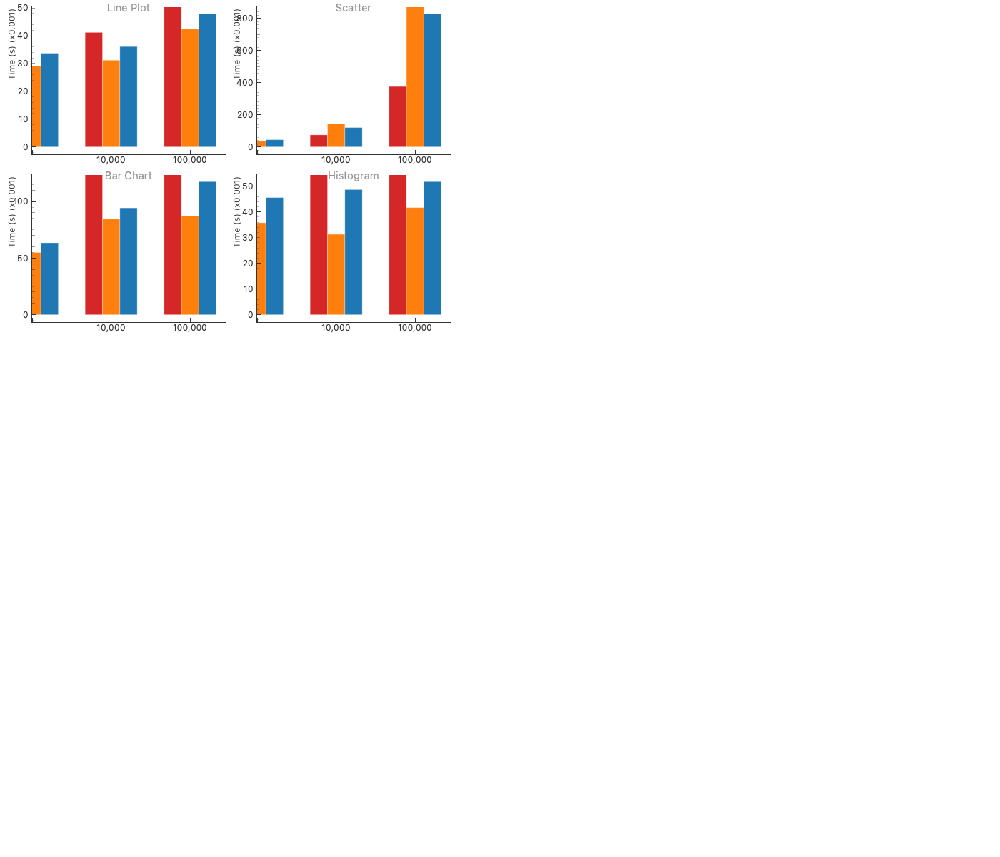

# ShenBi 性能基准测试报告

*生成时间：Tue  5 May 2026 10:32:58 CST*

[English Report](benchmark_report.md)

## 概述

对 **matplotlib**、**pyqtgraph** 和 **ShenBi** 在 4 种图表类型、3 种数据规模下的全面性能对比。

每次测试包含：创建图形 → 绑定数据 → 导出 PNG（30 DPI）。

## 测试环境

| 项目 | 值 |
|------|-----|
| 平台 | Darwin arm64 |
| Python | 3.12.12 |
| pyqtgraph | 0.14.0 |
| matplotlib | 3.10.8 |
| ShenBi | 0.1.1 |

## 折线图

| 数据量 | matplotlib | pyqtgraph | ShenBi | 比 mpl 快 |
|--------|-----------|-----------|--------|----------|
| 1,000 | 0.0413s | 0.0292s | 0.0337s | 1.2× |
| 10,000 | 0.0412s | 0.0312s | 0.0361s | 1.1× |
| 100,000 | 0.0567s | 0.0424s | 0.0479s | 1.2× |

## 散点图

| 数据量 | matplotlib | pyqtgraph | ShenBi | 比 mpl 快 |
|--------|-----------|-----------|--------|----------|
| 1,000 | 0.0398s | 0.0373s | 0.0447s | 0.9× |
| 10,000 | 0.0749s | 0.1445s | 0.1205s | 0.6× |
| 100,000 | 0.3764s | 1.1281s | 0.8295s | 0.5× |

## 柱状图

| 数据量 | matplotlib | pyqtgraph | ShenBi | 比 mpl 快 |
|--------|-----------|-----------|--------|----------|
| 1,000 | 0.1094s | 0.0550s | 0.0635s | 1.7× |
| 10,000 | 0.2112s | 0.0845s | 0.0943s | 2.2× |
| 100,000 | 0.2210s | 0.0874s | 0.1175s | 1.9× |

## 直方图

| 数据量 | matplotlib | pyqtgraph | ShenBi | 比 mpl 快 |
|--------|-----------|-----------|--------|----------|
| 1,000 | 0.0739s | 0.0358s | 0.0456s | 1.6× |
| 10,000 | 0.0751s | 0.0313s | 0.0487s | 1.5× |
| 100,000 | 0.0734s | 0.0417s | 0.0518s | 1.4× |

## 加速比汇总（matplotlib ÷ ShenBi）

| 数据量 | 折线图 | 散点图 | 柱状图 | 直方图 |
|--------|--------|--------|--------|--------|
| 1,000 | 1.2× | 0.9× | 1.7× | 1.6× |
| 10,000 | 1.1× | 0.6× | 2.2× | 1.5× |
| 100,000 | 1.2× | 0.5× | 1.9× | 1.4× |

## 分析

### ShenBi 优势场景

- **柱状图**：1.7–2.2× 加速 — 所有图表类型中优势最大
- **直方图**：1.4–1.6× 加速 — pyqtgraph 的 BarGraphItem 带来持续优势
- **折线图**：1.1–1.2× 加速 — 受益于自动降采样

### matplotlib 优势场景

- **散点图**：matplotlib 的 Agg 渲染器对散点图高度优化；ShenBi 的 pyqtgraph 后端为每个点创建单独的渲染项，在大数据量下增加了开销

### 结论

ShenBi 提供了与 matplotlib 兼容的语法和 pyqtgraph 级别的性能。  
对于柱状图、直方图和折线图，ShenBi 更快。  
对于散点图（>10K 点），matplotlib 的原生渲染更高效。

原始数据：[benchmark_results.json](benchmark_results.json)
